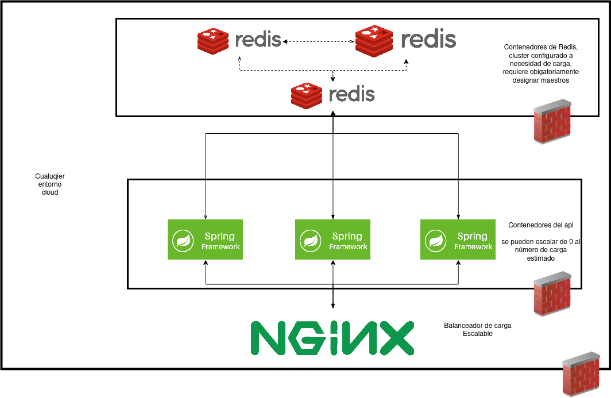

# Calculadora de números consecutivos

### Descripción
El siguiente proyecto es una calculadora que recibe n operandos de forma consecutiva y posteriormente al indicar un operador aplica la operacion sobre los operandos. las operaciones soportadas son:
- \* (producto)
- \+ (suma)
- \- (resta)
- \/ (división)
- \^ (potenciación)


### Arquitectura

El proyecto tiene principalmente dos contenedores un worker (código java) que realiza los calculos y un contenedor Redis que almacena los datos para operar. Se ha agregado un docker-compose.yml para despliegue de validar el correcto funcionamiento del codigo pero no es un ejempplo de despliegue a nivel productivo para eso emplearíamos la libreria jib pero necesitariamos una configuracion del cloud en el cual iría el contenedor y excede el alcance de este proyecto. Como punto pendiente sería interesante realizar un sistema en el cual las operaciones se paralelizaran pero escapa del alcance. Adicionalmente adjunto una arquitectura genérica para un posible despliegue en produccion, notese que es agnostica tanto de plataforma cloud como tecnologia de orquestación.



### Despliegue
Para poder ejecutar la aplicación necesitas tener instalado docker v20+ y docker-compose. El despliegue de la aplicación es meramente demostrativo y no es apto para entornos productivos.

La construcción del docker hace compilación progresiva con el fin de optimizar peso y seguridad en el mismo. Inicialmente se compila en un gradle y se exporta a un alpine con jre teniendo un usuario específico.

```bash
sh deploy
```

para detenerlo simplemente ejecute
```bash
docker-compose down
```

### Api
Para la siguente descripcion asumiremos que el __host__ es 127.0.0.1, adicionalmente dentro de la carpeta varios se incluye una colección de postman.

para corroborar que el api esta ejecutandose correctamente puede probar lo siguiente

```bash
curl --location --request GET 'http://127.0.0.1:8080'
```

para agregar un operando ejecute, en modo DEBUG muestra el valor de un elemento que cause error y su posiscion dentro de los agregados.

```bash
curl --location --request PUT 'http://127.0.0.1:8080/calculadora' \
--header 'Content-Type: application/json' \
--data-raw '{
    "sesionId": "misesion",
    "valor": "2"
}'
```
para ejecutar una operación ejecute. Tenga en cuenta que si no tiene una sesión la crea, la deja vacía y retorna la identidad de la operación.

```bash
curl --location --request POST 'http://127.0.0.1:8080/calculadora' \
--header 'Content-Type: application/json' \
--data-raw '{
    "sesionId": "misesion",
    "operador": "*"
}'
```

para elimiinar los datos de la sesion ejecute

```bash
curl --location --request DELETE 'http://127.0.0.1:8080/calculadora?sesionId=Leonardo'
```

### Pendientes
Implementar archivos de configuracion directamente en spring y no con patrones síngleton. Falta realizar scripts de despliegue continuo [depende de la plataforma de cloud] y optimización de las operaciones con thread pool en caso de ser plataformas multicore, puede ser valioso.
